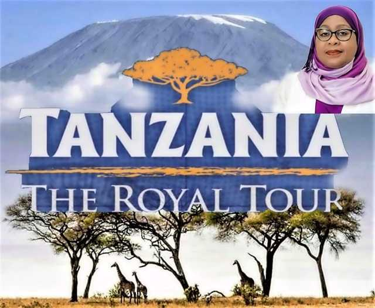
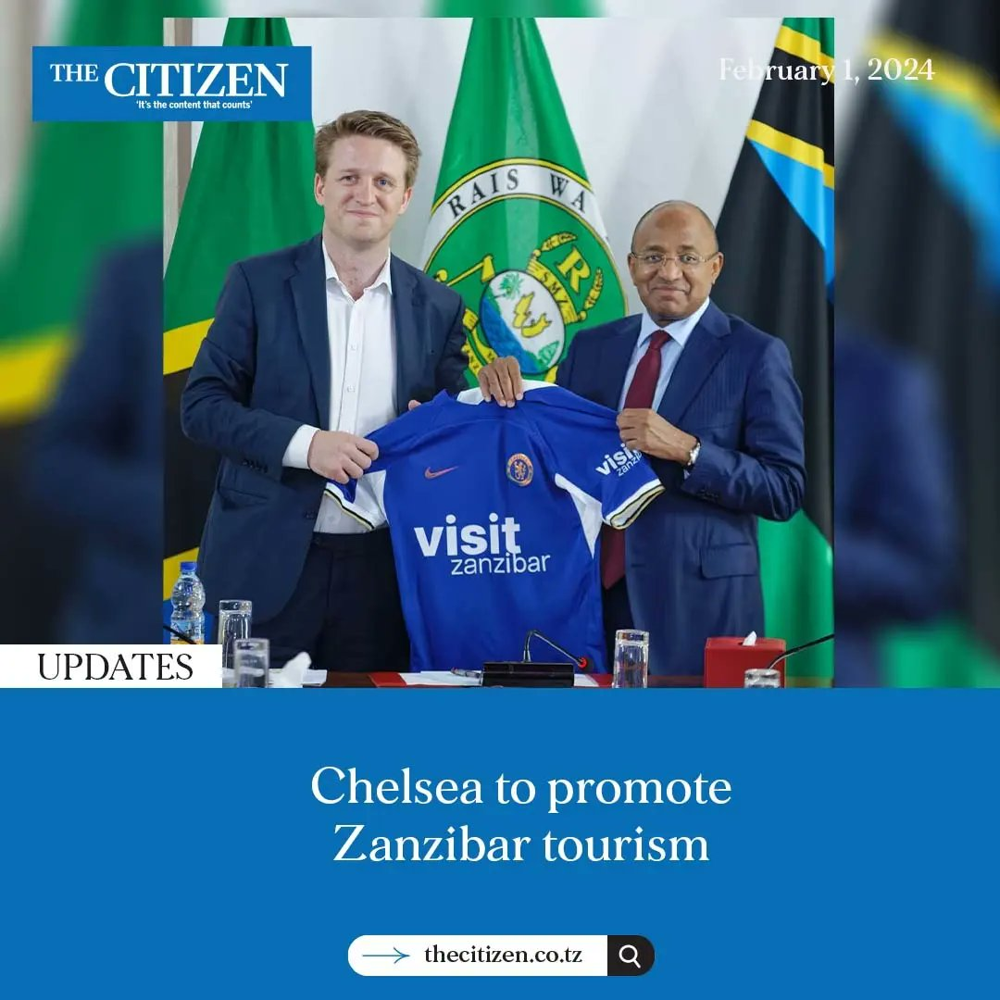

```{r setup, include=FALSE}
knitr::opts_chunk$set(echo = FALSE)
```

This data gives us the idea that both Tanzania mainland and Zanzibar tourism is a growing industry. The advantage is that Tanzania is a most fascinating tourism destination in the world, containing diverse attractions ranging from wildlife, beach, culture and historical events. Moreover, tourism in Tanzania has a highest potential multiplier effect which can provide direct and indirect jobs for Tanzanian citizens.

However, several challenges underlie Tanzanian tourism industry which includes host community low awareness about tourism attractions, some domestic tour operators providing low quality services, hiring of many foreign workers because the natives lack crucial skills to serve tourists.

Despite the challenges in Tanzanian tourism industry, it is not the end of the story in fact majority of stakeholders are doing everything in their power to support and improve the industry. For instance, the government is undertaking several actions like REGROW project (Resilient Natural Resource Management for Tourism and Growth) aiming to diversify tourism in the southern circuit, improving infrastructures for transport and accommodations in priority protected areas.

Moreover, the private organizations are major supporters of the industry whereby they contribute to several attributes like training skilled tourism work force, protecting attractions such as wildlife populations in the protected areas. Too much effort is carried on by every stakeholder to ensure Tanzanian tourism industry success.

To survive competition in the tourism market there are two factors that needs more implementation efforts. These factors include advertising Tanzanian attraction through media to the world, To ensure complete training of Tanzanian citizens to host their own tourism industry.

{width="400"}

{width="400"}

We see efforts from the presidents aiming to boost the Tanzanian tourism industry through media advertisement
